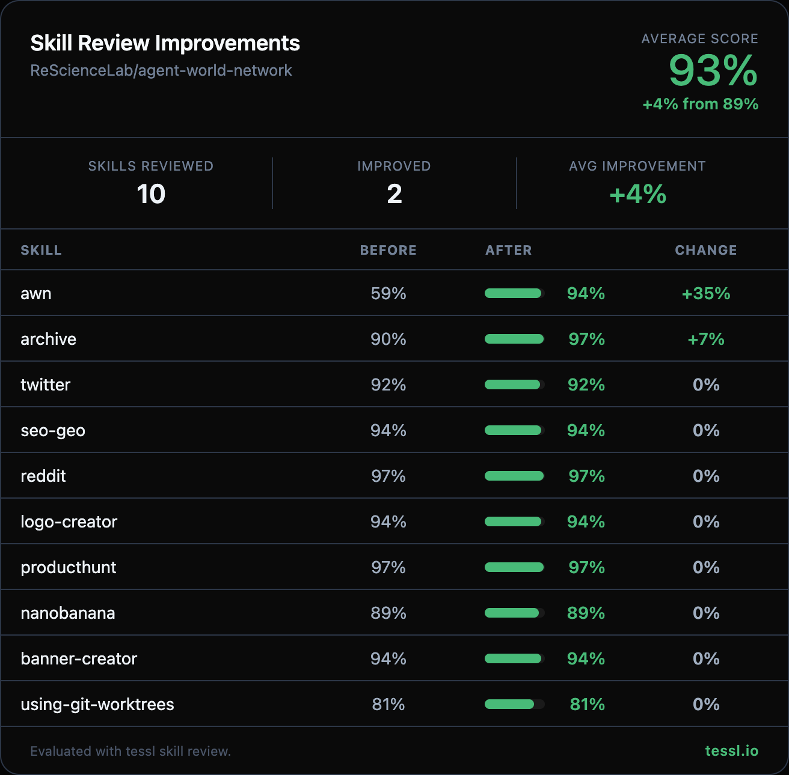

## What

Hey @Jing-yilin 👋

I ran your skills through `tessl skill review` at work and found some targeted improvements. Here's the full before/after:

| Skill | Before | After | Change |
|-------|--------|-------|--------|
| awn | 59% | 94% | +35% |
| archive | 90% | 97% | +7% |
| seo-geo | 94% | 94% | 0% |
| twitter | 92% | 92% | 0% |
| reddit | 97% | 97% | 0% (unchanged) |

## Why

The `awn` skill scored 59% because it was missing a "Use when..." trigger clause and had no getting-started workflow — agents couldn't reliably select it or follow a sequenced onboarding path. The other skills were already strong but had minor gaps flagged by the review.

## How

Changes made

**awn (59% → 94%, +35%)**
- Rewrote description to include explicit "Use when..." trigger clause with natural user phrases (send messages, peer-to-peer, join worlds, discover agents)
- Added numbered "Getting Started" workflow (start daemon → verify → discover → join → send) with validation steps
- Consolidated duplicate Usage section and Quick Reference table into a single "Command Reference" table
- Removed redundant Architecture diagram and verbose per-command sections to reduce token cost
- Kept World Actions, Data Directory, Configuration, Error Handling, and Rules sections intact

**archive (90% → 97%, +7%)**
- Added inline example of a complete archive entry with YAML frontmatter (tags, category, related fields) so agents can execute without reading references/TEMPLATE.md first
- Added sample MEMORY.md entry showing the expected one-line format

**seo-geo (94% → 94%)**
- Removed verbose "Use this for" annotations and separator lines after each audit command — agents infer usage from context
- Consolidated Quick Reference intro paragraph and Key Insight callout into the workflow directly

**twitter (92% → 92%)**
- Added Error Handling table covering 401/429 errors and empty responses with specific fixes

I kept this PR focused on the 3 skills with the biggest improvements to keep the diff reviewable. Happy to follow up with the rest in a separate PR if you'd like.

## Checklist

- [x] `npm run build` succeeds (no build files changed)
- [x] `node --test test/*.test.mjs` passes (no test files changed)
- [ ] New tests added for new functionality — N/A (skill docs only)
- [x] No secrets or sensitive data in the diff
- [x] Commit message follows conventional commits (`feat:`, `fix:`, etc.)

---

Honest disclosure — I work at @tesslio where we build tooling around skills like these. Not a pitch - just saw room for improvement and wanted to contribute.

Want to self-improve your skills? Just point your agent (Claude Code, Codex, etc.) at [this Tessl guide](https://docs.tessl.io/evaluate/optimize-a-skill-using-best-practices) and ask it to optimize your skill. Ping me - [@yogesh-tessl](https://github.com/yogesh-tessl) - if you hit any snags.

Thanks in advance 🙏
